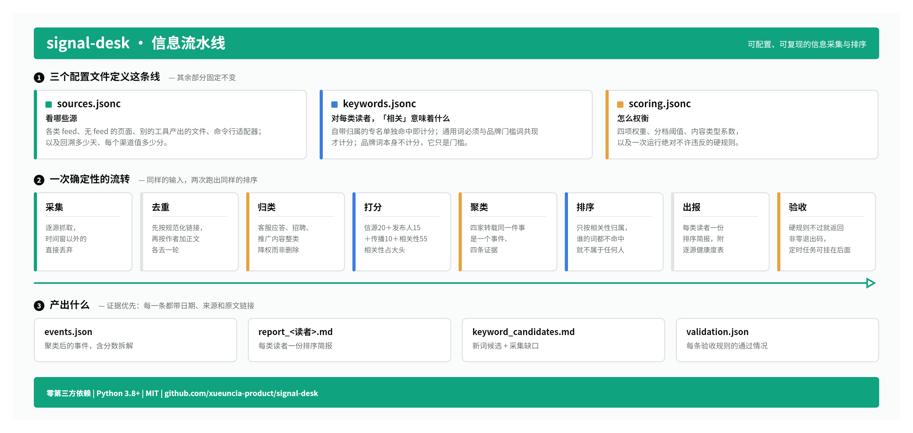

# signal-desk

一条可配置、可复现的信息流水线：从多个渠道采集，按**你自己的**关键词表和**你自己的**权重打分，给每类读者出一份排好序的简报——并用机械规则卡住那些人工每次都会犯的错。

零第三方依赖，Python 3.8+，克隆即可跑。

[English](README.md) · [配置说明](docs/configuration.md) · [适配器](docs/adapters.md) · [踩坑记录](docs/lessons.md)



## 先跑一遍

```bash
git clone https://github.com/xueuncia-product/signal-desk && cd signal-desk

python3 -m signaldesk doctor --config examples/minimal          # 检查配置
python3 -m signaldesk run    --config examples/minimal --workdir runs/demo
```

这会采两个真实 feed 加一份随仓库自带的样例数据，排好序、出简报、跑完验收。加 `--offline` 可以完全不联网跑通。

之后把 `examples/minimal/` 复制一份（`examples/full/` 展示了全部字段），换成你自己的信息源，就是你自己的那条线。

## 它解决什么

你本来就在跟一个行业、一组竞对、一个监管口子。真正费劲的不是读，而是同样的问题每周重演：

- 某个源悄悄挂了，它的沉默被读成「这周没事」；
- 同一条消息从五个地方进来，看起来像五条；
- 关键词表没人复核，实际上大半个词都从没命中过；
- 两个团队拿到两份「不同」的报告，其实是同一份。

signal-desk 把这些变成配置项和机械检查。

## 模型

**信息源**是配置文件里的类型化块，四种内置类型都不需要 API key：

| 类型 | 用途 |
|---|---|
| `rss` | 各类 feed——媒体、博客、Google News 检索、论坛、YouTube 频道 |
| `page_watch` | 没有 feed 的页面：牌照名录、费率页、政策项目页。首次只建基线，之后只报「变了且命中关注词」 |
| `json_import` | 别的工具已经产出的 JSON |
| `command` | 任何能把 JSON 打到 stdout 的命令行工具——自带缓存、重试和限流纪律 |

后两种是扩展点。本仓库**不内置**任何需要登录的抓取：凭证和平台条款是使用者自己的事，不是这个仓库该替你接受的。见 [docs/adapters.md](docs/adapters.md)。

**关键词表分两级**，每个视角一套：

```jsonc
"brand_gate": ["acme"],                  // 只作门槛，本身不计分
"proper":     {"acme ledger": 5},        // 自带归属，单独命中即计分
"gated":      {"refund": 3}              // 通用词，必须与门槛词共现才计分
```

「refund」单独出现可能是地球上任何一家公司的事。品牌词本身不计分——它出现在你采到的大部分内容里，没有区分力，它的职责是门槛而不是信号。

**打分是查表加算术**，不是模型判断，所以任何一条排名都能指着配置里的某一行解释：

```
总分 = 信源(20) + 发布人(15) + 传播(10) + 相关性(55) = 100
```

相关性占大头是刻意的：信源和发布人只决定这条信息**可不可信**，只有相关性决定它**是不是你的事**。

**按事件排，不按条目排。** 一份公告被四家媒体转载是一个事件、四条证据。跨不同信源层级的相互印证给一个有上限的加分；同一层级内的重复转载不加分。

**多视角。** 一次采集，每类读者一份排序报告。归属只看相关性——谁的关键词都不命中的条目不属于任何人，留在台账里，而不是推给所有人。

## 关键词发现

`run` 还会产出一份候选词清单：本周语料里冒出来、但还不在你配置里的词，按 频次 × 跨源数 × 新鲜度 排序。它**不会**自动改你的配置——关键词表就是这条线的定义，自动加词等于悄悄改定义，事后没人分得清哪些词是人选的。

把你自己的文档（月报、纪要、策略文档）放进 `internal/`，还会多出一份**缺口扫描**：你们内部在谈、但采集端根本没返回的词。这通常是整个流程里价值最高的产出，而且必须单独跑一遍——内部独有的词天然只出现在一个语料里，任何「必须跨 N 个源」的规则都会把它滤掉。

## 验收规则

`validate` 任一条不过就返回非零退出码，定时任务可以挂在它后面：

- 过期的、没有日期的，不许进核心/重要
- 招聘、推广等排除类内容不许进头部
- 各视角**实际分到**的头部清单确实不同
- 每个必需的信源层级都真的返回了数据
- 失败源数量在容忍范围内

## 命令

```bash
python3 -m signaldesk doctor    --config DIR              # 校验配置、检查适配器
python3 -m signaldesk collect   --config DIR --workdir W  # 采集 + 时间窗过滤
python3 -m signaldesk score     --config DIR --workdir W  # 去重、打分、聚类
python3 -m signaldesk report    --config DIR --workdir W  # 出 markdown 简报
python3 -m signaldesk discover  --config DIR --workdir W  # 候选词 + 缺口
python3 -m signaldesk validate  --config DIR --workdir W  # 验收
python3 -m signaldesk run       --config DIR --workdir W  # 以上全部
```

参数：`--today YYYY-MM-DD`（运行日期）、`--offline`（跳过联网源）、`--force`（忽略适配器缓存）。

自测：`python3 tests/selftest.py`

## 设计说明

这里每一条规则，都是因为「显而易见的那个做法」先被试过、并且给出了看起来对的错答案：过滤器实际上一条都没滤掉、限流失败把成功的缓存覆盖了、关键词表里三分之二的词从没命中过、两份「不同」的报告其实一模一样。[docs/lessons.md](docs/lessons.md) 是完整清单——改打分模型之前先读它，里面大部分东西不吃一次亏是想不到的。

## 许可

MIT，见 [LICENSE](LICENSE)。
